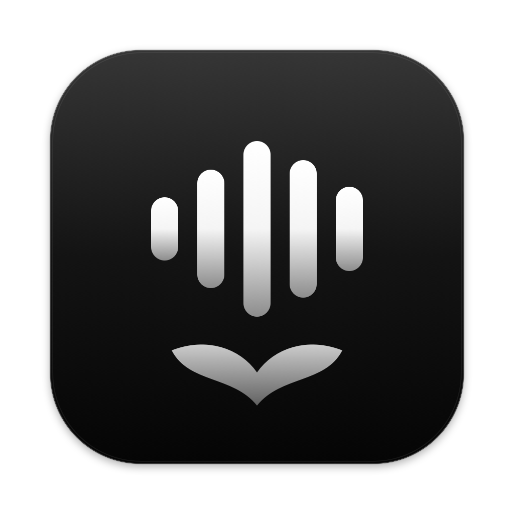

<p align="center">
  
</p>

# Orcaudio

Local Cantonese + English dictation for Orca, Cursor and the ChatGPT desktop app (including Codex mode) on Apple Silicon Macs.
Speak naturally, insert text into your chat input, then review and send it yourself.

## Features

- On-device Qwen3-ASR 1.7B, MLX 8-bit recognition. No paid API or cloud transcription.
- Traditional Chinese output with English words preserved; no text-generation model.
- Configurable app-scoped shortcut (default Control–Option–Space), system-default microphone or a selected device.
- Animated voice capsule beside the input; falls back near the active supported window when caret coordinates are unavailable.
- English and Traditional Chinese interface; English by default.
- Choose which apps to enable (Orca only by default). Optional launch with any enabled app, manual model download, and live MLX memory usage.

## Requirements and first use

Apple Silicon Mac, macOS 14 or later. Intel builds are not provided.

1. Put the standalone app in Applications and open it.
2. In Settings, download **Qwen3-ASR 1.7B · 8-bit** (approximately 2.47 GB). The app ships without a model.
3. Allow Microphone and Accessibility access.
4. In Settings, enable the apps you want to use. Bring one to the front and press the shortcut to start; press again to stop. Escape cancels. Maximum recording length is two minutes.

Orcaudio locates the main chat input using accessibility structure, without matching placeholder text or fixed screen coordinates. If it is not focused, Orcaudio focuses it and places the cursor after any draft. An already focused input keeps its selection/cursor; selected text is replaced on paste. Cursor support targets its Agents chat interface, not the code editor or terminal. ChatGPT and Codex modes in the desktop app share the ChatGPT switch.

Search/rename fields, dialogs, missing or ambiguous inputs produce a short reminder instead of recording. In other apps the shortcut is not consumed, so their own shortcuts continue to work.

The app only attempts paste; it never sends Return. Moving to another input, conversation, window or app prevents automatic paste. A temporary Copy control is available for the current result. The capsule disappears after two seconds; no result history is kept. Check the input before manually pasting again if paste confirmation is unavailable.

## Storage and privacy

The standalone app stores one model copy under:

```
~/Library/Application Support/Orcaudio/models/Qwen3-ASR-1.7B-8bit
```

Downloads require an explicit click, can be cancelled/resumed, and are checked against a 3 GB model budget. Deleting the model never triggers an automatic download. Cancelled downloads retain partial model files for resuming; Delete model removes them.

Temporary recordings are removed after success, cancellation, failure or normal exit. If the app is forcibly terminated, its remaining recording files are cleaned on the next launch. There is no recording archive, transcript log or telemetry.

The recognition worker communicates over stdin/stdout and runs with network access denied. Downloads use a separate network-enabled process. The model unloads after ten idle minutes. MLX cache is limited to 128 MiB and cleared after recognition. Memory shown in Settings is MLX active/cache unified memory, not GPU compute utilization or total process RAM.

The standalone app and runtime occupy approximately 457 MB, separate from the 2.47 GB model. Source checkouts also have an ignored development environment and build products.

## Build

Build prerequisites: Apple Silicon, Xcode Command Line Tools, and `uv`.

```sh
./setup.sh
./build.sh
open dist/Orcaudio.app
```

The development app uses this checkout's Python environment and `models/` directory. Rebuild it after moving the checkout.

To package Python/MLX inside the app, without a model or checkout dependency:

```sh
./build.sh --portable
```

Output: `release/Orcaudio.app`. End users do not need Python, uv or Xcode. Do not run the development and standalone builds simultaneously.

Set `ORCAUDIO_VERSION` when building an assigned release version. Settings reads the bundle version; the current development version is 0.3.0.

The build script applies local ad-hoc signing. Rebuilding may require macOS permissions to be granted again.

## Source layout

- `Sources/`: native menu app, recording, focus/paste safety, settings, download controller and voice overlay.
- `Helpers/`: optional supported-app launch watcher.
- `asr.py`: model loading, audio validation/resampling and transcription.
- `worker.py`: offline JSON-lines recognition process and memory readings.
- `download_model.py`: explicit download of a pinned model revision.
- `Assets/`, `scripts/IconRenderer.swift`: icons and their editable generator.
- `tests/`: synthetic fixtures and automated regression tests; no personal recordings or evaluation results.

## Regression tests

```sh
./scripts/test.sh
```

Run from a configured checkout. Worker/resource integration tests need the model installed in the checkout's `models/` directory. Tests synthesize temporary audio and delete it afterwards; they do not record from the microphone or submit text to Orca.

## Optional launch helper

Enabling Launch with enabled apps installs a user LaunchAgent at `~/Library/LaunchAgents/local.stellacheng.orcaudio.watcher.plist` and a small helper under `~/Library/Application Support/Orcaudio/Launcher`. Disabling the setting removes both. The helper observes launches of the apps selected in Settings, and checks whether one is already running when the helper starts. Closing those apps leaves Orcaudio in the menu bar; it does not load the model or record audio.
